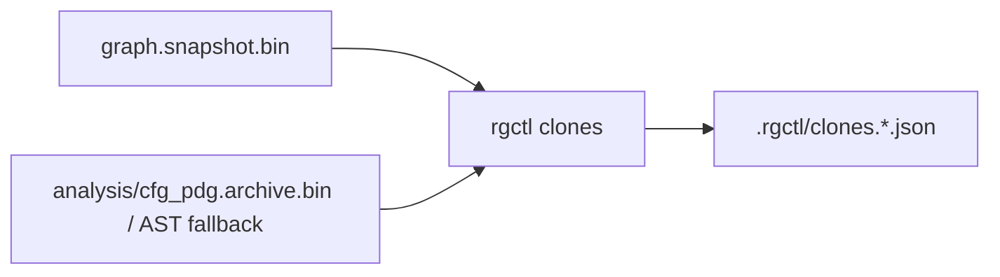

# Clone detection design

**Goal:** First-class **exact (Type-1)** clone groups via `code_hash`, with a versioned JSON report and `.rgctl/clones.json` sidecar — distinct from `semantic query`.

**Issue:** [#37](https://github.com/sshaaf/rgctl/issues/37) · OpenSpec: `openspec/changes/add-clone-detection/`

**Non-goals (M1):** Type-2 normalization, PDG isomorphism, default `CLONE_OF` topology edges, replacing semantic search.

---

## Mode matrix

| Mode | Signal | Status |
|------|--------|--------|
| `exact` | Equal non-empty `code_hash` on Function nodes | **Shipped (M1)** |
| `bloom` | Token bloom Jaccard (LSH band candidates) | **Shipped (M2)** — labeled `candidates: true` |
| `fragment` | CFG SESE hammock decomposition + 1-WL canonical hashing | **Shipped (M3)** — schema_version: 2 |
| `semantic` | Embedding NN above threshold | Reserved (needs semantic index) |
| `structural` | PDG/CFG confirmation on candidates | Reserved (opt-in; never O(n²) on linux) |

Exact = identical hashed body bytes under current extract prep (BLAKE3), **not** AST-normalized Type-2.
Fragment = sub-function single-entry single-exit (SESE) hammocks ($3 \le |S| \le 15$) hashed with 2 iterations of Weisfeiler-Lehman (1-WL) canonical color refinement (Type-2 invariant).

---

## Architecture



- **Query-time:**
  - `exact`: scan columnar Function index → group by `code_hash` → filter → emit JSON.
  - `bloom`: 64-bit LSH bands over 256-bit `token_bloom` → Jaccard pairs ≥ threshold → connected components.
  - `fragment`: two-stage filtering:
    - Stage 1: coarse bitwise bloom pre-filter `(func.bloom & seed_bloom) == seed_bloom` in $\mathcal{O}(N)$ bitwise time (~30ms).
    - Stage 2: SESE hammock decomposition + 1-WL canonical hashing on candidate CFGs (~150ms).
- **Sidecars:** full-repo reports write `.rgctl/clones.json` (exact), `.rgctl/clones.bloom.json` (bloom), or `.rgctl/clones.fragment.json` (fragment) keyed by `graph_digest`; stale digests are invalidated.
- **No topology pollution:** default discover never writes clone edges into `graph.snapshot.bin`. Gate A cold discover wall is strictly preserved.

---

## JSON schema (v1)

```typescript
type CloneReport = {
  schema_version: 1;
  mode: "exact" | "bloom";
  graph_digest: string;
  filters: { min_loc?: number; exclude: string[]; language?: string };
  threshold?: number;       // bloom min Jaccard (default 0.85)
  candidates?: boolean;     // true for bloom (not Type-1)
  group_count: number;
  groups: Array<{
    mode: "exact" | "bloom";
    hash?: string;          // exact only
    size: number;           // ≥ 2
    members: Array<{
      id: string;
      name: string;
      file?: string;
      start_line?: number;
      end_line?: number;
      loc?: number;
    }>;
    confidence?: number;    // 1.0 exact; Jaccard for bloom
    score?: number;         // bloom: min pairwise Jaccard in group
  }>;
  seed?: { /* same as member */ };  // symbol-scoped only
};
```

### JSON schema (v2) — Fragment clones (`--mode fragment`)

```typescript
type FragmentCloneReport = {
  schema_version: 2;
  mode: "fragment";
  graph_digest: string;
  filters: {
    min_statements: number; // default 3
    max_statements: number; // default 15
    threshold: number;      // default 1.0 (exact structural)
    exclude: string[];
  };
  seed?: {
    file: string;
    start_line: number;
    end_line: number;
    enclosing_function?: string;
    structural_hash: string;
  };
  group_count: number;
  groups: Array<{
    structural_hash: string;
    size: number;
    score: number;
    members: Array<{
      id: string;
      name: string;
      file: string;
      start_line: number;
      end_line: number;
      enclosing_function: string;
      statement_count: number;
    }>;
  }>;
};
```

Defaults: `min_loc = 5`, bloom `threshold = 0.85`, fragment `min_statements = 3`, `max_statements = 15`. Bare `--exclude test` matches a **path component** named `test` (not substring of `rgctl-tests`).

**Bloom algorithm:** LSH bands = each non-zero `u64` word of the 256-bit `token_bloom`; pairwise Jaccard inside band buckets (skip buckets &gt; 512). Connected components → groups. Sidecar: `.rgctl/clones.bloom.json`.

**Fragment algorithm:** SESE hammock extraction on CFGs filtered by statement bounds ($3 \le |S| \le 15$). Weisfeiler-Lehman 2-iteration canonical hashing mapping statement kinds (`If`, `Loop`, `Call`, `Assign`, `Decl`, `Return`) and edge attributes (`Next`, `IfTrue`, `IfFalse`, def-use). Stage 1 bitwise bloom pre-filter evaluates `(func.bloom & seed_bloom) == seed_bloom` in $\mathcal{O}(N)$ bitwise time. Stage 2 evaluates candidate CFGs. Sidecar: `.rgctl/clones.fragment.json`.

---

## CLI

```bash
rgctl -f json clones --mode exact [--min-loc N] [--exclude GLOB] [--lang ID]
rgctl -f json clones --mode bloom [--threshold 0.85] [--min-loc N] [--exclude GLOB]
rgctl -f json clones --mode fragment [--seed SYMBOL|FILE:LINES] [--lines START-END] [--min-statements N] [--max-statements N] [--threshold F]
rgctl -f json clones SYMBOL --file PATH [--class C] [--line N]
```

Disambiguation matches callers (`--file` / `--class` / `--line`). Help text states this is **not** an alias of `semantic query`.

---

## Performance

M1 is **not** on the discover extract / pass-1 hot path. Gate A (linux cold discover ≤ 159.5 s) must remain green; exact clones add no discover stage.

Pre-change reference (2026-10-09, v0.4.19): wall ≈ 119.5 s; stages dominated by `index_extract`, `extract_pass1`, `index_graph_build`, `graph_spill_columnar`.

Post-M1 Gate A (`linux_cold_discover_within_baseline`, same day): wall **123.8 s** (pass ≤ 159.5 s). No `clone_*` discover stage — clones remain query-time.

M3 structural work (when implemented) MUST be candidate-only + opt-in, with a linux profile gate.

---

## vs semantic search

| | `clones` | `semantic query` |
|--|----------|------------------|
| Question | Implementations like **each other** | Functions like **this query** |
| Unit | Groups / pairs | Ranked hits |
| Exact mode | `code_hash` equality | N/A |
