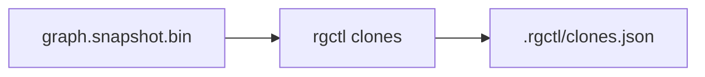

# Clone detection design

**Goal:** First-class **exact (Type-1)** clone groups via `code_hash`, with a versioned JSON report and `.rgctl/clones.json` sidecar — distinct from `semantic query`.

**Issue:** [#37](https://github.com/sshaaf/rgctl/issues/37) · OpenSpec: `openspec/changes/add-clone-detection/`

**Non-goals (M1):** Type-2 normalization, PDG isomorphism, default `CLONE_OF` topology edges, replacing semantic search.

---

## Mode matrix

| Mode | Signal | Status |
|------|--------|--------|
| `exact` | Equal non-empty `code_hash` on Function nodes | **Shipped (M1)** |
| `bloom` | Token bloom Jaccard / Hamming | Reserved (`mode` string only) |
| `semantic` | Embedding NN above threshold | Reserved (needs semantic index) |
| `structural` | PDG/CFG confirmation on candidates | Reserved (opt-in; never O(n²) on linux) |

Exact = identical hashed body bytes under current extract prep (BLAKE3), **not** AST-normalized Type-2.

---

## Architecture



- **Query-time:** scan columnar Function index → group by `code_hash` → filter → emit JSON.
- **Sidecar:** full-repo exact reports may write `.rgctl/clones.json` keyed by `graph_digest`; stale digests are ignored.
- **No topology pollution:** default path never writes clone edges into `graph.snapshot.bin`.

---

## JSON schema (v1)

```typescript
type CloneReport = {
  schema_version: 1;
  mode: "exact";
  graph_digest: string;
  filters: { min_loc?: number; exclude: string[]; language?: string };
  group_count: number;
  groups: Array<{
    mode: "exact";
    hash: string;
    size: number;           // ≥ 2
    members: Array<{
      id: string;
      name: string;
      file?: string;
      start_line?: number;
      end_line?: number;
      loc?: number;
    }>;
    confidence?: number;    // 1.0 for exact
    score?: number;         // reserved for M2/M3
  }>;
  seed?: { /* same as member */ };  // symbol-scoped only
};
```

Defaults: `min_loc = 5`. Bare `--exclude test` matches a **path component** named `test` (not substring of `rgctl-tests`).

---

## CLI

```bash
rgctl -f json clones --mode exact [--min-loc N] [--exclude GLOB] [--lang ID]
rgctl -f json clones SYMBOL --file PATH [--class C] [--line N]
```

Disambiguation matches callers (`--file` / `--class` / `--line`). Help text states this is **not** an alias of `semantic query`.

---

## Performance

M1 is **not** on the discover extract / pass-1 hot path. Gate A (linux cold discover ≤ 159.5 s) must remain green; exact clones add no discover stage.

Pre-change reference (2026-10-09, v0.4.19): wall ≈ 119.5 s; stages dominated by `index_extract`, `extract_pass1`, `index_graph_build`, `graph_spill_columnar`.

Post-M1 Gate A (`linux_cold_discover_within_baseline`, same day): wall **123.8 s** (pass ≤ 159.5 s). No `clone_*` discover stage — clones remain query-time.

M3 structural work (when implemented) MUST be candidate-only + opt-in, with a linux profile gate.

---

## vs semantic search

| | `clones` | `semantic query` |
|--|----------|------------------|
| Question | Implementations like **each other** | Functions like **this query** |
| Unit | Groups / pairs | Ranked hits |
| Exact mode | `code_hash` equality | N/A |
