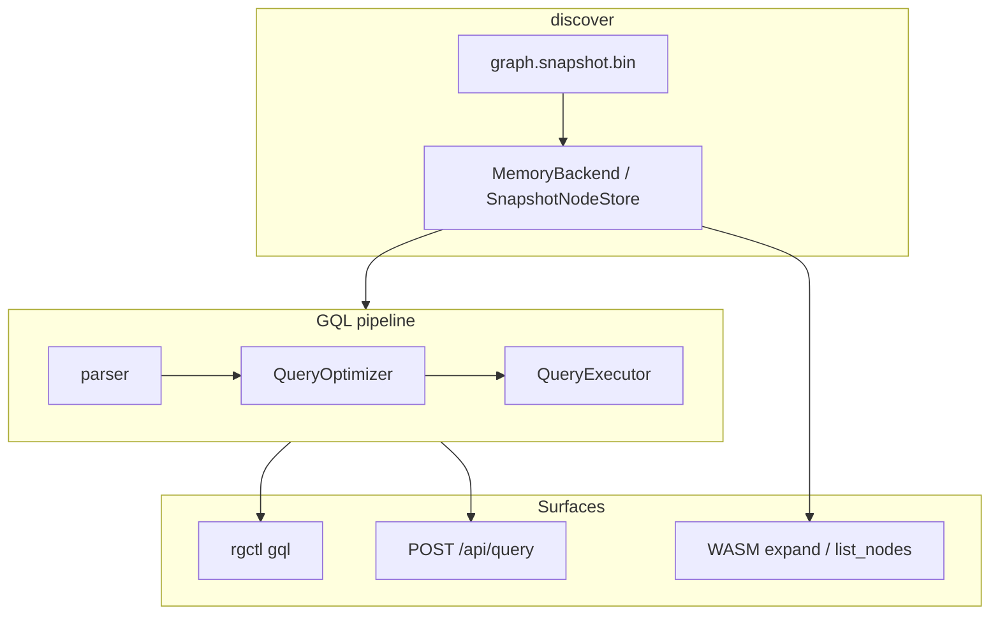

# Graph Query Language (GQL) — Engineering Design

**Cypher-like graph queries** over the indexed knowledge graph: 30+ node and edge types, macros, explain plans, and HTTP access via `serve`.


*Figure 1: **Graph Visualization** tab — package metagraph (WebGL), community colors, and drill-down into member functions. CLI `gql` queries the same underlying graph.*


*Figure 2: Full dashboard context — stat cards, tab bar, and graph exploration surface.*

---

## 1. Goals

| Goal | How |
|------|-----|
| Precise structural queries | `MATCH` patterns over typed nodes/edges |
| Fast inventory | Named macros (`all_functions`, `call_chain`, …) |
| Agent automation | `-f json` rows + `POST /api/query` |
| Explainability | `--explain` optimization plan |

**Note:** `export --query` uses **filter syntax** (`name:Foo`, `type:Function`, `all`) — not full GQL. Use `gql` for `MATCH` patterns.

---

## 2. Architecture overview



---

## 3. Query language (subset)

```cypher
MATCH (n:Function) WHERE n.name LIKE '*Service*' RETURN n LIMIT 20
MATCH (a:Function)-[:CALLS*1..3]->(b:Function) RETURN a, b
MATCH (n:Class) WHERE n.qualified_name = 'com.example.Foo' RETURN n
```

`n.name` is the simple/bare name; use `n.qualified_name` for language FQNs (e.g. Java package paths).

**Macros** (positional query ignored when `--macro-name` set):

| Macro | Purpose |
|-------|---------|
| `all_functions` | Function inventory |
| `direct_calls` | Call edges |
| `call_chain` | Chains up to 3 hops |

---

## 4. Rust implementation map

| Component | Path |
|-----------|------|
| Parser / AST | `crates/rgctl-gql/src/parser.rs`, `ast.rs` |
| Optimizer | `crates/rgctl-gql/src/optimizer.rs` |
| Executor | `crates/rgctl-gql/src/executor.rs` |
| Macros | `crates/rgctl-gql/src/macros.rs` |
| CLI | `src/cli/gql.rs` |
| HTTP | `src/cli/http_serve.rs` (`/api/query`) |

---

## 5. Dashboard implementation

There is no dedicated GQL tab. Exploration maps to:

| Dashboard | GQL equivalent |
|-----------|----------------|
| Graph metagraph + drill-down | `MATCH` on `Function` / `Calls`, `export` |
| Functions table | `all_functions` macro |
| Query Guide tab | Copy-paste CLI workflows (`guideCliWorkflows.ts`) |

---

## 6. CLI and HTTP usage

```bash
rgctl discover .
rgctl gql 'MATCH (n:Function) RETURN n LIMIT 5'
rgctl -f json gql --macro-name all_functions unused
rgctl gql --explain 'MATCH (n:Function) WHERE n.name = "Foo" RETURN n'

rgctl serve --open
curl -sS -X POST http://127.0.0.1:8080/api/query \
  -H 'Content-Type: application/json' \
  -d '{"macro":"all_functions"}' | jq '.count'
```

See [http-api.md](../http-api.md).

### Virtual communities (analysis overlay)

Communities are **not** stored in `graph.snapshot.bin`. After discover, `gql` / `/api/query` join `.rgctl/analysis_results.bin`:

| Pattern | Meaning |
|---------|---------|
| `MATCH (c:Community) RETURN c` | List named communities (macro: `all_communities`) |
| `WHERE f.community_id = '12'` | Filter functions by assignment |
| `c.label` / `member_count` | Properties on virtual community nodes |

Labels are heuristic; see [community-query-and-naming-plan.md](community-query-and-naming-plan.md).

---

## 7. Testing

| Layer | Location |
|-------|----------|
| GQL crate tests | `crates/rgctl-gql/src/` |
| CLI subprocess | `tests/cli_output/all_commands_sanity.rs` |
| Query Guide validation | `dashboard/scripts/validate-guide-cli-gbuilder.sh` |

Screenshots: `capture-design-screenshots.mjs` → `docs/images/design/gql/`.

---

## 8. Related docs

- [Graph metrics design](graph-metrics-design.md)
- [Export](../Introduction.md#export-and-sharing) — filter syntax vs GQL
- [JSON API](../json-api.md) · [HTTP API](../http-api.md)
