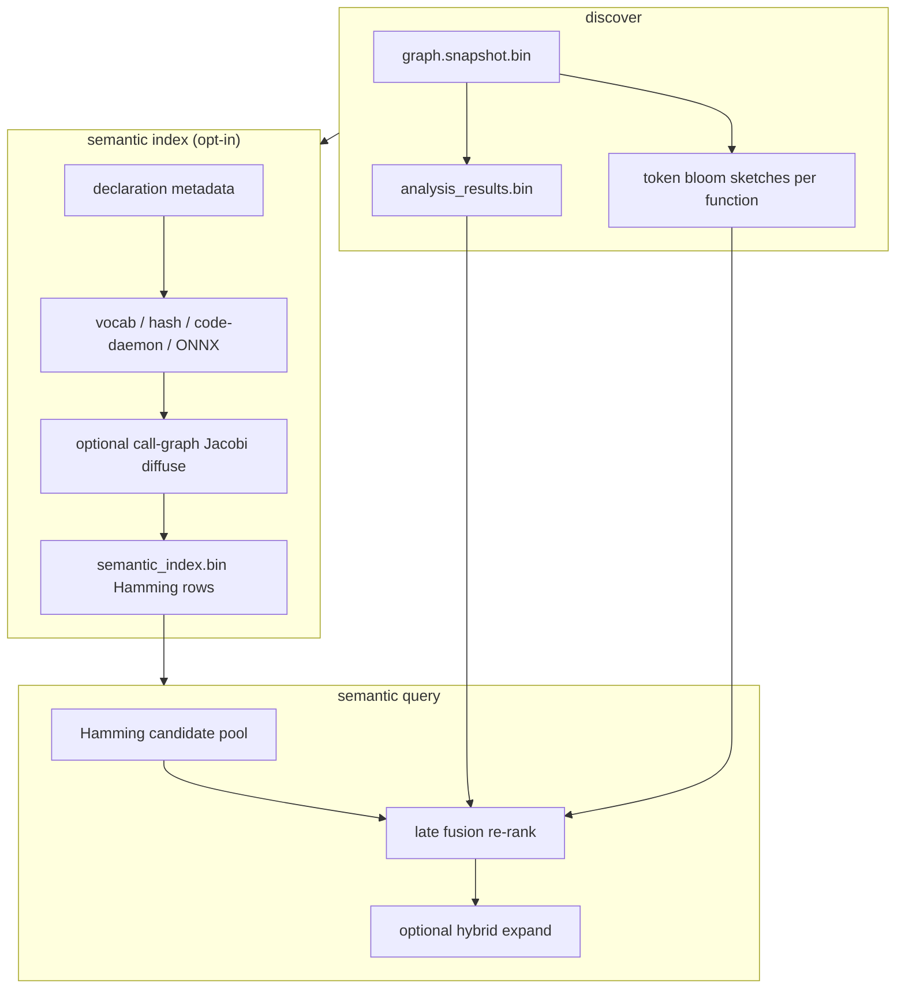

# Semantic Search — Engineering Design

**Opt-in natural-language and keyword search** over indexed function symbols: binary-quantized embeddings (default **vocab** token table), Hamming retrieval, optional **late fusion** with blast radius, PageRank, name overlap, and eager **token-bloom** sketches from discover.


*Figure 1: Dashboard **Search** tab — Ready badge, query controls (late fusion, keyword AND), and ranked hit table.*

---

## 1. Goals

| Goal | How |
|------|-----|
| Find functions by intent, not exact names | vocab token-table embeddings (256-d default); optional code-daemon ONNX |
| Keep discover lean | Separate `.rgbuilder/semantic_index.bin` — built via `semantic index` |
| Fast retrieval at scale | Sign-quantized vectors + Hamming top-k |
| Blend structure + semantics | Late fusion re-ranks Hamming pool with graph signals |
| Agent-ready output | `-f json semantic query` + HTTP `/api/semantic/query` |
| Incremental rebuilds | Reuse rows when `code_hash` unchanged (toggling `--embed-bodies` changes `model_id`) |

---

## 2. Architecture overview



**Two-stage retrieval** (`semantic_fusion.rs`): Hamming pre-filter (default pool 256) → weighted fusion of semantic, blast, centrality, name, and sketch scores.

---

## 3. Embedders

| Embedder | CLI | Notes |
|----------|-----|-------|
| **vocab** (default) | `--embedder vocab` | Compiled bag-of-tokens (`vocab-accumulate-v1` FNV, or `v2` after `semantic distill`); offline; native **256-d** |
| **sign-hash** | `--embedder hash` | Deterministic FNV sign-hash — CI / `--no-default-features` |
| **code-daemon** | `--embedder code-daemon` | Bundled ONNX + SentencePiece in `rgbuilder-analysis/assets/`; requires `semantic-onnx` feature |
| **custom ONNX** | `--embedder onnx --model PATH` | Optional `--tokenizer` for SentencePiece |

Default dimensions: **256**. Declaration metadata only unless `--embed-bodies`. `git lfs pull` is needed only for `--embedder code-daemon` (~206 MB weights).

**Index-time diffusion (opt-in):** `--diffuse` runs Jacobi mixing over the call graph on dense `f32` buffers (CallGraph-sized, one scratch) before sign quantization. Defaults: α=0.25, 2 iterations, callees-only (`--diffuse-bidirectional` for callers+callees). Query does not re-diffuse — structure is baked into bits. **`--diffuse` always re-embeds** (skips the pure incremental bit-reuse shortcut) so bits reflect the diffused dense vectors. Extra RSS ≈ `n_functions × dims × 4 × 2` bytes (≈ 3.8 GB peak buffers at 1.86M × 256); keep `--diffuse` off on huge repos until profiled.

Escape hatch for builds without ONNX:

```bash
cargo build --release --no-default-features
rgctl semantic index                    # vocab still works without ONNX
# or: rgctl semantic index --embedder hash
```

---

## 4. Structural sketches (Phase A)

At discover/extract time, each function gets a **256-bit token bloom** (`structural_sketch.rs`) over declaration + body tokens. Sketches are stored on graph nodes and used for:

- **Keyword AND** filter — every query token must hit metadata or sketch
- **Fusion term** — Jaccard-style overlap between query tokens and sketch

No extra index pass required beyond normal `discover`.

---

## 5. Rust implementation map

| Component | Path |
|-----------|------|
| Index + Hamming search | `crates/rgbuilder-analysis/src/semantic_search.rs` |
| Vocab accumulator | `crates/rgbuilder-analysis/src/semantic_vocab.rs` |
| Call-graph diffusion | `crates/rgbuilder-analysis/src/semantic_diffuse.rs` |
| Body token extraction | `crates/rgbuilder-analysis/src/semantic_extract.rs` |
| Late fusion | `crates/rgbuilder-analysis/src/semantic_fusion.rs` |
| Hybrid expansion | `crates/rgbuilder-analysis/src/semantic_hybrid.rs` |
| Bundled code-daemon | `crates/rgbuilder-analysis/src/semantic_embedded.rs` |
| ONNX runtime path | `crates/rgbuilder-analysis/src/semantic_onnx.rs` |
| Token bloom at extract | `crates/rgbuilder-graph/src/structural_sketch.rs` |
| CLI | `src/cli/semantic.rs`, `semantic_output.rs` |
| HTTP API | `src/cli/semantic_api.rs`, `http_serve.rs` |
| Manifest export | `crates/rgbuilder-export/src/manifest.rs` |

---

## 6. Dashboard implementation

| Piece | Path |
|-------|------|
| Tab | `dashboard/src/SearchView.tsx` |
| HTTP client | `dashboard/src/semanticSearch.ts` |
| Status + query API | `GET /api/semantic/status`, `POST /api/semantic/query` |

Requires `rgctl serve` (not static `python -m http.server`) so the semantic API is available.

---

## 7. CLI usage

```bash
rgctl discover .
rgctl semantic index                    # default vocab, 256-d, no source re-read
rgctl semantic distill --matrix crates/rgbuilder-analysis/assets/vocab_matrix.bin
# teacher: code-daemon (our ONNX). Rebuild rgctl to compile v2 into the binary.
rgctl semantic index --incremental      # reuse unchanged code_hash rows
rgctl -f json semantic query "shopping cart checkout" --limit 10
rgctl -f json semantic query "OrderService" --keyword-and
rgctl -f json semantic query "auth login" --expand neighbors --expand-depth 2
# Fusion is on by default; use --no-fusion for pure Hamming

rgctl serve --open   # dashboard Search tab + /api/semantic/*
```

Index-only flags: `--embedder`, `--dimensions`, `--model`, `--tokenizer`, `--embed-bodies`, `--incremental`,
`--diffuse` / `--no-diffuse`, `--diffuse-alpha`, `--diffuse-iters`, `--diffuse-bidirectional`.

Query flags: `--no-fusion` (fusion is on by default), `--keyword-and`, `--candidate-pool`, `--expand`, `--expand-depth`.

```bash
# Neural extra / hash CI
rgctl semantic index --embedder code-daemon
rgctl semantic index --embedder hash
rgctl semantic index --embed-bodies          # append function-body identifier tokens
```

---

## 8. On-disk artifacts

| Path | Content |
|------|---------|
| `.rgbuilder/semantic_index.bin` | Quantized embeddings + metadata (schema v2) |
| `.rgbuilder/dashboard/manifest.json` | `semantic` section when index present |

---

## 9. Testing

| Layer | Location |
|-------|----------|
| Hamming + index roundtrip | `crates/rgbuilder-analysis/src/semantic_search.rs` tests |
| Vocab accumulate | `crates/rgbuilder-analysis/src/semantic_vocab.rs` tests |
| Call-graph diffusion | `crates/rgbuilder-analysis/src/semantic_diffuse.rs` tests |
| Fusion scoring | `crates/rgbuilder-analysis/src/semantic_fusion.rs` tests |
| QE oracles | `tests/semantic_search_qe.rs` |
| Multi-query timing | `tests/semantic_query_timing.rs` (polyglot CI; linux ignored + `RGBUILDER_LINUX_SEMANTIC=1`, prefer `--release`) |
| CLI subprocess | `tests/cli_output/subprocess_golden_path.rs` |
| HTTP semantic API | `src/cli/http_serve.rs` unit tests |

Time linux-scale Hamming with a **release** build — debug can be ~100× slower on the scan. Index **load** is dominated by bincode deserialization of per-function string metadata (~tens of seconds at ~1.8M rows); query after load is a few milliseconds in release.

Regenerate screenshots:

```bash
rgctl -r ~/git/java/gbuilder semantic index
rgctl -r ~/git/java/gbuilder serve --port 8080
DASHBOARD_URL=http://127.0.0.1:8080/ node dashboard/scripts/capture-design-screenshots.mjs
```

Demo video (5 s per feature, tab + panel highlighted):

```bash
DASHBOARD_URL=http://127.0.0.1:8080/ node dashboard/scripts/record-feature-demo.mjs
```

---

## 10. Related docs

- [Blast radius design](blast-radius-design.md) — fusion blast term + hybrid `--expand blast`
- [Graph metrics design](graph-metrics-design.md) — PageRank centrality term
- [HTTP API](../http-api.md) — `/api/semantic/*`
- [CLI / JSON API](../json-api.md) — semantic JSON shapes
