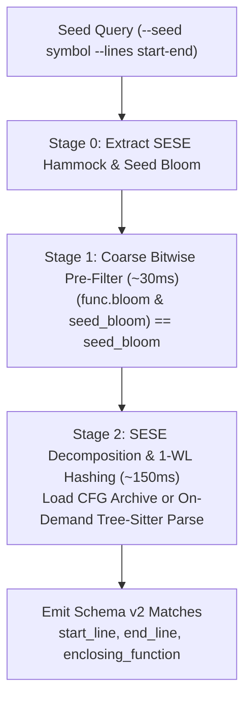

# Clone Detection

## Introduction

The `clones` command detects duplicated code across your repository. Unlike whole-file comparison tools or brute-force pairwise AST isomorphism, `rgctl` uses high-performance graph representations, token sketches, and canonical graph hashing to detect both whole-function and sub-function clones in sub-second time without polluting the graph snapshot.

`rgctl` provides three complementary clone detection modes:

| Mode | Target | Technique | Guarantee | Schema |
|------|--------|-----------|-----------|--------|
| **`exact`** | Whole function | BLAKE3 `code_hash` equality | Type-1 exact body match | v1 |
| **`bloom`** | Whole function | 256-bit `token_bloom` LSH bands + Jaccard | Type-2 similarity candidate | v1 |
| **`fragment`** | Sub-function | CFG SESE hammocks + 1-WL canonical hash | Type-2 structural match ($3 \le |S| \le 15$) | v2 |

> [!NOTE]
> **Clone detection vs. Semantic search:** `clones` answers *"Where else is this exact code or control-flow fragment copied?"* by grouping implementations against each other. Conversely, `semantic query` answers *"Which functions implement this natural-language intent?"* via dense embedding nearest neighbors.

---

## Use Cases

- **Refactoring & Deduplication:** Find duplicated 5- to 15-statement loops or error-handling blocks copied across services, even if local variables were renamed.
- **Bug Fix Propagation:** When fixing a security vulnerability or edge-case bug in a method, locate every copy-pasted variant across the codebase.
- **Boilerplate Auditing:** Identify repeated validation routines, data marshaling snippets, or retry loops that should be extracted into shared library helpers.
- **Codebase Health Metrics:** Measure implementation divergence across microservices or multi-module repositories.

---

## Architecture & Algorithms

### Sub-Function Fragment Clones (`--mode fragment`)

Instead of arbitrary linear sliding windows (which break under interleaved comments or minor edits) or exponential subgraph isomorphism ($\mathcal{O}(2^{|V|})$), `rgctl` extracts and matches **Single-Entry Single-Exit (SESE) hammocks**:



1. **SESE Hammock Extraction:** Bounded by statement count ($3 \le |S| \le 15$), CFG regions are identified using dominator trees and post-dominator trees ([`crates/rgctl-analysis/src/sese.rs`](../../crates/rgctl-analysis/src/sese.rs)). Every path entering the region enters through node $u$, and every path exiting leaves through node $v$.
2. **Weisfeiler-Lehman (1-WL) Canonical Hashing:** Subgraphs are assigned invariant 64-bit structural hashes using 2 iterations of 1-WL color refinement ([`crates/rgctl-analysis/src/wl_hash.rs`](../../crates/rgctl-analysis/src/wl_hash.rs)). Statements are categorized into normalized kinds (`If`, `Loop`, `Call`, `Assign`, `Decl`, `Return`) and combined with directed edge tags (`Next`, `IfTrue`, `IfFalse`, Def-Use). Renaming variables, adding comments, or reformatting whitespace does not alter the hash.
3. **Two-Stage Filtering:**
   - **Stage 1 (Bitwise Pre-Filter):** Evaluates `(func.bloom & seed_bloom) == seed_bloom` in $\mathcal{O}(N)$ bitwise time across all functions in `graph.snapshot.bin`, pruning $>95\%$ of functions before any parsing occurs.
   - **Stage 2 (CFG Matching):** Evaluates candidate functions by reading from `.rgctl/analysis/cfg_pdg.archive.bin` (if built with `--with-cfg`) or performing fast, ephemeral tree-sitter parses.

---

## Step-by-Step Walkthrough

### 1. Build the Graph Snapshot

Clone detection queries the pre-built snapshot:

```bash
rgctl discover .
```

To enable fast-path CFG loading from the archive during fragment queries, you can optionally include `--with-cfg`:

```bash
rgctl discover . --with-cfg
```

---

### 2. Whole-Function Exact Clones (`--mode exact`)

Locate all functions with identical code bodies (Type-1 clones):

```bash
rgctl -f json clones --mode exact --min-loc 5 --exclude test
```

**Output:**

```json
{
  "schema_version": 1,
  "mode": "exact",
  "graph_digest": "4a7b9c...",
  "filters": {
    "min_loc": 5,
    "exclude": ["test"]
  },
  "group_count": 1,
  "groups": [
    {
      "mode": "exact",
      "hash": "9eec51b8...",
      "size": 2,
      "confidence": 1.0,
      "members": [
        {
          "id": "e3b0c442-...",
          "name": "normalizePayload",
          "file": "src/service/ServiceA.java",
          "start_line": 42,
          "end_line": 58,
          "loc": 17
        },
        {
          "id": "7f83b165-...",
          "name": "normalizePayload",
          "file": "src/legacy/LegacyHelper.java",
          "start_line": 15,
          "end_line": 31,
          "loc": 17
        }
      ]
    }
  ]
}
```

Writes `.rgctl/clones.json` sidecar cache keyed by `graph_digest`.

---

### 3. Whole-Function Similarity Candidates (`--mode bloom`)

Locate functions with similar vocabulary using 256-bit token Bloom sketches:

```bash
rgctl -f json clones --mode bloom --threshold 0.85 --min-loc 8 --exclude test
```

**Output:**

```json
{
  "schema_version": 1,
  "mode": "bloom",
  "graph_digest": "4a7b9c...",
  "filters": {
    "min_loc": 8,
    "exclude": ["test"]
  },
  "threshold": 0.85,
  "candidates": true,
  "group_count": 1,
  "groups": [
    {
      "mode": "bloom",
      "size": 2,
      "confidence": 0.91,
      "score": 0.91,
      "members": [
        {
          "id": "...",
          "name": "processBatchV1",
          "file": "src/batch/v1.rs",
          "start_line": 10,
          "end_line": 35,
          "loc": 25
        },
        {
          "id": "...",
          "name": "processBatchV2",
          "file": "src/batch/v2.rs",
          "start_line": 12,
          "end_line": 38,
          "loc": 26
        }
      ]
    }
  ]
}
```

Writes `.rgctl/clones.bloom.json` sidecar cache keyed by `graph_digest`.

---

### 4. Seed-First Sub-Function Fragment Clones (`--mode fragment`)

To find where an 8-line loop or guarded block from `process_orders` is duplicated elsewhere in the project:

```bash
rgctl -f json clones --mode fragment --seed process_orders --lines 24-32
```

**Output:**

```json
{
  "schema_version": 2,
  "mode": "fragment",
  "graph_digest": "4a7b9c...",
  "filters": {
    "min_statements": 3,
    "max_statements": 15,
    "threshold": 1.0,
    "exclude": []
  },
  "seed": {
    "file": "src/orders.rs",
    "start_line": 24,
    "end_line": 32,
    "enclosing_function": "process_orders",
    "structural_hash": "f9cbad17fbe21cb2"
  },
  "group_count": 1,
  "groups": [
    {
      "structural_hash": "f9cbad17fbe21cb2",
      "size": 2,
      "score": 1.0,
      "members": [
        {
          "id": "a1b2c3d4-...",
          "name": "process_orders",
          "file": "src/orders.rs",
          "start_line": 24,
          "end_line": 32,
          "enclosing_function": "process_orders",
          "statement_count": 5
        },
        {
          "id": "e5f6a7b8-...",
          "name": "audit_orders",
          "file": "src/audit.rs",
          "start_line": 40,
          "end_line": 48,
          "enclosing_function": "audit_orders",
          "statement_count": 5
        }
      ]
    }
  ]
}
```

**What this tells you:**
- Even though `audit_orders` has different arguments, a different overall function body, and potentially renamed loop variables, the 5-statement loop spanning lines 40–48 in `src/audit.rs` has the **exact same control-flow topology and statement structure** as lines 24–32 in `process_orders`.

---

### 5. Resolving Ambiguous Seed Symbols

If a function name appears in multiple files:

```bash
rgctl clones --mode fragment --seed process_orders
```

`rgctl` detects the ambiguity and returns:

```text
Error: Ambiguous symbol 'process_orders': 2 matches
```

Disambiguate by providing the file path:

```bash
rgctl -f json clones --mode fragment --seed process_orders --file src/orders.rs --lines 24-32
```

---

### 6. Repo-Wide Fragment Discovery

To mine all duplicated sub-function fragments across the whole codebase without specifying a seed:

```bash
rgctl -f json clones --mode fragment --min-statements 3 --max-statements 15
```

This scans all indexed functions, extracts SESE hammocks within the statement bounds, groups them by their 1-WL canonical hash, and writes `.rgctl/clones.fragment.json`.

---

## CLI Options

| Option | Modes | Default | Description |
|--------|-------|---------|-------------|
| `--mode <MODE>` | All | `exact` | Detection mode: `exact`, `bloom`, or `fragment`. |
| `--seed <SEED>` | `fragment` | — | Seed function name or `file:lines` coordinate. |
| `--file <PATH>` | `fragment`, symbol-scoped | — | Disambiguation file path. |
| `--lines <START-END>` | `fragment` | — | 1-based line range (e.g. `24-32`) targeting a specific snippet. |
| `--min-statements <N>` | `fragment` | `3` | Minimum statements in an extracted SESE hammock. |
| `--max-statements <N>` | `fragment` | `15` | Maximum statements in an extracted SESE hammock. |
| `--min-loc <N>` | `exact`, `bloom` | `5` | Minimum lines of code for whole functions. |
| `--threshold <F>` | `bloom`, `fragment` | `0.85` (bloom), `1.0` (fragment) | Similarity threshold score. |
| `--exclude <GLOB>` | All | `[]` | Exclude matching path components (e.g. `--exclude test`). |
| `--lang <LANG>` | `exact` | — | Filter functions by programming language. |
| `--no-cache` | `exact`, `bloom` | `false` | Bypass reading `.rgctl/clones*.json` sidecar. |
| `--no-write` | `exact`, `bloom` | `false` | Prevent writing `.rgctl/clones*.json` sidecar. |

---

## Working with `jq`

Extract summary metrics:

```bash
# Top 5 exact clone groups by size
rgctl -f json clones --mode exact \
  | jq '{group_count, top: [.groups[:5][] | {size, hash: .hash[0:12], names: [.members[].name]}]}'

# Fragment clone member locations
rgctl -f json clones --mode fragment --seed process_orders --lines 24-32 \
  | jq '.groups[] | {hash: .structural_hash, members: [.members[] | {fn: .enclosing_function, loc: "\(.file):\(.start_line)-\(.end_line)"}]}'
```

---

## Related Documentation

- [JSON API Reference (`clones`)](../json-api.md#16b-clones)
- [Clone Detection Design](../design/clone-detection-design.md)
- [Command Encyclopedia: `clones`](../../skills/rgctl/references/command-encyclopedia.md#clones)
- [Inspecting CFG, PDG, and Dominance](inspecting-cfg-pdg-dominance.md)
