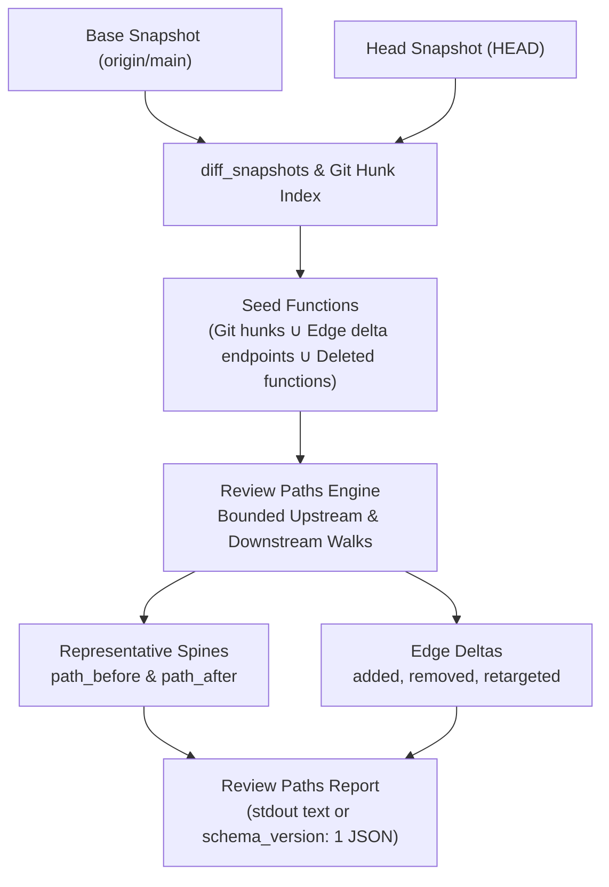

# Pull Request Review

## Introduction

Git diffs show what syntax changed line-by-line, but they cannot explain how **call paths** across the architecture were altered, which callers were rewired, or whether changes introduced new architectural violations.

The `review` command family provides **temporal pull-request analysis**:

| Command | Purpose | Output / Exit Code |
|---------|---------|---------------------|
| **`rgctl review paths`** | Structural before/after call-path inspection | Call spines, edge deltas (`added`/`removed`/`retargeted`), unscored files. Exits **0** on report completion (truncation flags set in JSON); exits **2** on ambiguous `--symbol`. |
| **`rgctl review check`** | Temporal architectural CI policy gate | Classifies violations as `new`, `existing`, `resolved`, or `regression`. Exits **0** on pass; exits **1** on failure. |
| **`rgctl pr-check`** | Backward-compatible alias for `review check` | Identical syntax, payload, and exit semantics. |

---

## Use Cases

- **Code Review Exploration:** Quickly see the ripple effect of PR changes without manually jumping between caller and callee definitions.
- **Refactoring Verification:** Confirm that a deprecated method call was cleanly replaced by its successor (`retargeted` delta) across all call sites.
- **Impact Triage:** When reviewing a high-risk PR, inspect the upstream and downstream call chains anchored on the modified functions.
- **Architectural CI Gates:** Automatically block PRs that introduce `new` violations (such as crossing domain boundaries or exceeding blast-radius limits) without failing on pre-existing legacy debt (`existing`).

---

## Architecture & How It Works

`rgctl review` compares two states of the knowledge graph: a **base snapshot** (the target branch, e.g. `origin/main`) and a **head snapshot** (the PR branch, e.g. `HEAD`):



1. **Seed Identification:**
   - Functions and methods whose code intersects git diff hunks (`EntityScope`).
   - Endpoints of modified `Calls` edges discovered by snapshot diffing.
   - Base-only functions that were deleted in the PR branch.
2. **Stable Node Identity:**
   - Functions are tracked across commits using [`StableNodeKey`](../../crates/rgctl-graph/src/stable_key.rs) (UUID-independent identities derived from qualified names and signatures).
3. **Spine Construction:**
   - For each changed symbol, `rgctl` extracts a representative **before** and **after** call spine:
     - **Upstream:** Traverses reverse `Calls` edges up to `--upstream-depth` (default 2), prioritizing paths involved in edge deltas.
     - **Downstream:** Traverses forward `Calls` edges up to `--downstream-depth` (default 1), prioritizing rewired callees.
4. **Edge Delta Classification:**
   - `added`: A call edge exists on head but not base ($+ \text{from} \to \text{to}$).
   - `removed`: A call edge exists on base but not head ($- \text{from} \to \text{to}$).
   - `retargeted`: A caller's target was redirected ($\text{from}: \text{to\_before} \to \text{to\_after}$).

---

## Step-by-Step Walkthrough

### 1. Preparing Base & Head Graph Snapshots

`review` commands require both base and head graph artifacts:

#### Option A: Automatic Head Synthesis (Default)
If you have a base snapshot saved under `{repo}/.rgctl-base/` (or via `--base-artifact`), `rgctl` synthesizes the head graph on the fly using git hunks and name-status deltas:

```bash
# 1. On main branch: index and copy to .rgctl-base
git checkout main
rgctl discover .
mkdir -p .rgctl-base && cp -a .rgctl/* .rgctl-base/

# 2. Switch back to your PR branch
git checkout my-feature-branch
```

#### Option B: Dual Full Snapshots (`--full-snapshots`)
If you build both base and head explicitly (e.g. in a CI pipeline with cached artifacts):

```bash
# Base artifact in /tmp/base-rgctl, Head artifact in .rgctl
rgctl review paths \
  --base-artifact /tmp/base-rgctl/graph.snapshot.bin \
  --head-artifact .rgctl/graph.snapshot.bin \
  --base-ref origin/main --head-ref HEAD \
  --full-snapshots
```

---

### 2. Inspecting PR Call Paths (`review paths`)

Run `review paths` on your feature branch to inspect call path changes:

```bash
rgctl review paths --base-ref origin/main --head-ref HEAD
```

**Human-Readable Text Output:**

```text
review paths: 2 symbols, 0 unscored files

processOrder:
  before: OrderController → processOrder → legacyBillingService
  after:  OrderController → processOrder → paymentGateway
  delta: processOrder: legacyBillingService → paymentGateway (retargeted)

validateCart:
  before: CartController → validateCart
  after:  CartController → validateCart → inventoryClient
  delta: + validateCart → inventoryClient
```

For automated tooling and LLM agents, pass `-f json`:

```bash
rgctl -f json review paths --base-ref origin/main --head-ref HEAD
```

**JSON Output:**

```json
{
  "schema_version": 1,
  "command": "review paths",
  "change_summary": {
    "changed_symbols": 2,
    "call_edges": {
      "added": 1,
      "removed": 1,
      "retargeted": 1,
      "unchanged": 14
    },
    "files_in_scope": 3,
    "unscored_files": 0
  },
  "truncation": {
    "symbols": false,
    "fanout": false,
    "depth": false
  },
  "symbols": [
    {
      "stable_key": "src/order.rs::processOrder",
      "name": "processOrder",
      "kind": "function",
      "base": {
        "file": "src/order.rs",
        "start_line": 45,
        "end_line": 80
      },
      "head": {
        "file": "src/order.rs",
        "start_line": 45,
        "end_line": 82
      },
      "path_before": [
        "OrderController",
        "processOrder",
        "legacyBillingService"
      ],
      "path_after": [
        "OrderController",
        "processOrder",
        "paymentGateway"
      ],
      "path_delta": [
        {
          "kind": "retargeted",
          "from": "processOrder",
          "to_before": "legacyBillingService",
          "to_after": "paymentGateway"
        }
      ],
      "truncation": {
        "symbols": false,
        "fanout": false,
        "depth": false
      }
    }
  ],
  "unscored_files": [],
  "ambiguous": []
}
```

---

### 3. Focusing on a Specific Symbol

To examine call paths for a specific method rather than all changed symbols:

```bash
rgctl review paths --base-ref origin/main --head-ref HEAD --symbol processOrder
```

If the symbol name is ambiguous across multiple files, `rgctl` prints candidate matching files and exits with code `2`:

```text
Ambiguous --symbol; candidates:
  processOrder (src/order.rs)
  processOrder (src/legacy/order.rs)
```

---

### 4. Adjusting Traversal Depths and Caps

For wide architectures or deep call chains, tune traversal parameters:

```bash
rgctl -f json review paths \
  --base-ref origin/main --head-ref HEAD \
  --upstream-depth 3 \
  --downstream-depth 2 \
  --fanout 15 \
  --max-symbols 100
```

- `--upstream-depth <N>`: How many caller hops above the symbol to explore (default `2`).
- `--downstream-depth <N>`: How many callee hops below the symbol to explore (default `1`).
- `--fanout <N>`: Maximum neighbors inspected per hop before truncating (default `10`).
- `--max-symbols <N>`: Maximum changed symbols included in the report (default `50`).

If a cap is exceeded, the report sets `truncation.symbols` or `truncation.fanout` to `true` while still exiting `0`.

---

### 5. Running the Temporal CI Policy Gate (`review check`)

While `review paths` provides qualitative call chain evidence, `review check` acts as an enforceable CI gate:

```bash
rgctl -f json review check \
  --policy-file rgctl-pr-policy.json \
  --base-ref origin/main \
  --head-ref HEAD \
  --strict
```

**JSON Output:**

```json
{
  "schema_version": "2",
  "passed": false,
  "violations": [
    {
      "symbol": "processOrder",
      "classification": "new",
      "violation": {
        "kind": "blast_radius_exceeded",
        "max_impact_nodes": 50,
        "actual_impact_nodes": 78
      },
      "stable_key": 1048576
    }
  ],
  "violations_summary": {
    "new": 1,
    "existing": 3,
    "resolved": 0,
    "regression": 0
  },
  "graph_diff": {
    "nodes_added": 2,
    "nodes_removed": 0,
    "nodes_changed": 3,
    "edges_added": 4,
    "edges_removed": 1
  },
  "scope": {
    "files": 2,
    "entities": 4
  }
}
```

- **`new`**: Violation was introduced by this PR.
- **`existing`**: Violation already existed on the base branch; ignored when `new_violations_only: true`.
- **`resolved`**: Violation existed on the base branch and was fixed by this PR.
- **`regression`**: Violation that was previously resolved has reappeared.

Exit code is `1` if `passed` is `false`, and `0` when clean.

---

## CLI Flag Reference

### `review paths` Options

| Flag | Default | Description |
|------|---------|-------------|
| `--base-ref <REF>` | Required | Git base reference (e.g. `origin/main`). |
| `--head-ref <REF>` | `HEAD` | Git head reference (e.g. `HEAD`). |
| `--base-artifact <PATH>` | `.rgctl-base/` | Path to base snapshot artifact. |
| `--head-artifact <PATH>` | `.rgctl/` | Path to head snapshot artifact. |
| `--full-snapshots` | `false` | Use pre-built dual snapshots instead of delta head synthesis. |
| `--synthetic-head <MODE>` | — | Synthetic head mode (`worktree` for uncommitted edits). |
| `--upstream-depth <N>` | `2` | Reverse caller hops to traverse. |
| `--downstream-depth <N>` | `1` | Forward callee hops to traverse. |
| `--symbol <NAME>` | — | Scope report to a specific function or method. |
| `--fanout <N>` | `10` | Maximum branch fanout per node. |
| `--max-symbols <N>` | `50` | Maximum symbols included in report. |

### `review check` Options

| Flag | Default | Description |
|------|---------|-------------|
| `--policy-file <PATH>` | Required | Path to JSON policy file. |
| `--base-ref <REF>` | Required | Git base reference. |
| `--head-ref <REF>` | `HEAD` | Git head reference. |
| `--strict` | `false` | Treat warnings as errors. |
| `--bisect` | `false` | Identify specific commit introducing violation. |

---

## Working with `jq`

Extract key insights from `review paths` JSON:

```bash
# 1. Summary of changed edges and symbols
rgctl -f json review paths --base-ref origin/main --head-ref HEAD \
  | jq '.change_summary'

# 2. List all retargeted calls
rgctl -f json review paths --base-ref origin/main --head-ref HEAD \
  | jq '[.symbols[].path_delta[] | select(.kind == "retargeted")]'

# 3. Before and after call spines for all modified functions
rgctl -f json review paths --base-ref origin/main --head-ref HEAD \
  | jq '.symbols[] | {name, before: (.path_before | join(" -> ")), after: (.path_after | join(" -> "))}'
```

---

## Related Documentation

- [CI Policy Checks Guide](ci-policy-checks.md)
- [Blast Radius Analysis Guide](blast-radius-analysis.md)
- [JSON API Reference: `review` (§8b–8c)](../json-api.md#8b-review-check--pr-check)
- [Command Encyclopedia: `review`](../../skills/rgctl/references/command-encyclopedia.md)
- [Agent Workflows: PR Review](../../skills/rgctl/references/workflows.md#pr-review--call-paths-review-paths)
